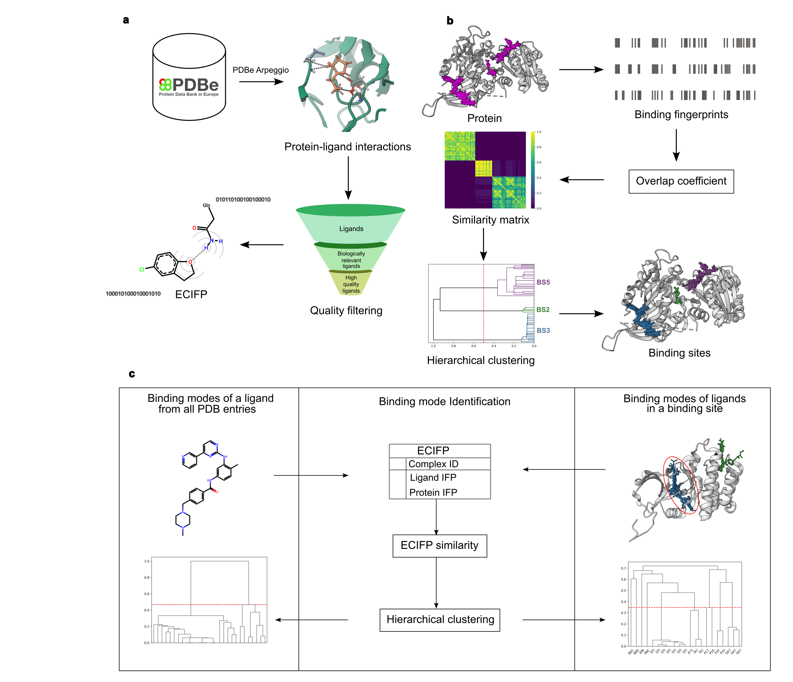

# ECIFP - Extended Connectivity Interaction Fingerprints

An interaction fingerprint for analyzing protein-ligand contacts, binding site and binding mode similarities.

## Overview

This project provides tools for:
- Generating Extended Connectivity Interaction Fingerprints (ECIFP) for protein-ligand complexes in the PDB
- Identifying and analyzing binding sites
- Computing binding mode and binding site similarity
- Comparing protein-ligand interaction patterns



## Requirements

- Python ≥ 3.12
- [uv](https://github.com/astral-sh/uv) package manager

## Installation

### 1. Install uv (if not already installed)

```bash
# macOS/Linux
curl -LsSf https://astral.sh/uv/install.sh | sh

# Windows
powershell -c "irm https://astral.sh/uv/install.ps1 | iex"

# With pip
pip install uv
```

### 2. Clone the repository

```bash
git clone https://github.com/PDBeurope/ecifp.git
cd ecifp
```

### 3. Create virtual environment and install dependencies

```bash
# Create a virtual environment and install all dependencies
uv sync

# This will:
# - Create a .venv directory
# - Install Python 3.12 if needed
# - Install all dependencies from pyproject.toml
# - Lock versions in uv.lock
```

### 4. Activate the virtual environment

```bash
# macOS/Linux
source .venv/bin/activate

# Windows
.venv\Scripts\activate
```

## Running the Notebooks

### Using Jupyter Lab (Recommended)

```bash

# Start Jupyter Lab
jupyter lab

# Navigate to the nbs/ directory and open any notebook
```

## Notebooks

The `nbs/` directory contains the following Jupyter notebooks:

### 1. `generate_ecifp.ipynb`
Generates Extended Connectivity Interaction Fingerprints (ECIFP) for protein-ligand complexes using their interaction data


### 2. `generate_binding_site_fp.ipynb`
Generates fingerprints for binding sites of proteins based on their ligand interacting residues


### 3. `binding_site_identification.ipynb`
Clusters ligands to distinct non-overlapping binding sites based on the similarity of their binding site fingerprints


### 4. `binding_site_similarity.ipynb`
Evaluating the performance of ECIFP for binding site comparisons using benchmark data from 


### 5. `binding_mode_similarity.ipynb`
Demonstrating the use of ECIFP for binding mode simialrities of ligands


## Project Structure

```
ecifp/
├── README.md                # This file
├── pyproject.toml           # Project dependencies and configuration
├── uv.lock                  # Locked dependency versions
├── ecifp/                   # Main Python package
│   ├── __init__.py
│   ├── fp_sim.py           # Fingerprint generation and similarity calculations
│   └── utils.py            # Utility functions
├── nbs/                    # Jupyter notebooks
│   ├── generate_ecifp.ipynb
│   ├── generate_binding_site_fp.ipynb
│   ├── binding_site_identification.ipynb
│   ├── binding_site_similarity.ipynb
│   └── binding_mode_similarity.ipynb
└── images/                  # figures
```


## License

CC0 1.0 Universal

## Citation

[Add citation information if applicable]
